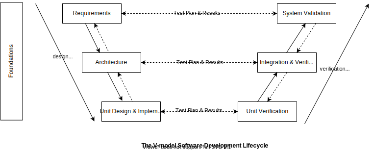

CPEN 432 / Project 2

**Due Feb 25, 2021, by 11:59 p.m.**

Introduction
===

The goal of this programming assignment is twofold. First, to learn about software engineering activities that are essential to developing reliable and safety-critical embedded software. Second, to learn about interrupt 
	handling in embedded systems, which is one of the most critical components of any embedded kernel, and which needs to be developed to the highest standards and with the utmost rigor. As you will see below, in safety-critical code only a "safe" subset of the language can be used, and restrictions on programming constructs are imposed in order to achieve predictability; for instance, one cannot do dynamic memory allocation and therefore one cannot use any of the memory C standard library functions `malloc/calloc/free`, no recursion, no use of global variables, etc.  


You will be writing an Interrupt Vector Table and Interrupt Service Routines (ISR) for the Raspberry Pi. You will then use your interrupt kernel to explore the ARM timer module again
but through interrupts. Afterwards, you will be using the interrupt and timer mechanisms you implemented to write a supervisor mode application that 
receives input from the user through the console and adjusts the flashing frequency of the OK LED of your RPi. *You will be carrying out rigorous software engineering life cycle activities and practices as outlined below to developing these software components*. 

Recall that in the previous project, your UART implementation was **polled**. _In this project, everything will be **interrupt-driven**, including UART implementation, so you 
will have to change your UART implementation accordingly_. You will still be working with the mini UART (section 2 of `BCM2835.pdf`), and **not** the PL011 UART (whose description is in section 13 of `BCM2835.pdf`).

**This programming assignment consists of 3 programming tasks**. All of these tasks will be developed in accordance with the V Software Development Life Cycle (SDLC) described in Part 1 below. 

Make sure to read all the material preceding a task before 
attempting it. This project involves progressively building and improving an interrupt-driven mini UART, so _we suggest reading the entire project description before attempting any
task in order to get your priorities sorted out and have a 
clear development plan_.

------------------------------------------------------------------------------- 

# Part 1: Software Engineering Activities 
Recall that our projects are assumed to be in the context of a safety-critical system, where failure or inadequate intended functionality can contribute to the occurrence of hazards that can lead to harm. For instance suppose that, in the setting of an autonomous vehicle, a perception task periodically samples the sensors for nearby road objects and constructs a view of the environment, and then fires an interrupt whenever it finishes processing a frame so that the control task computes the appropriate control given the updated view of the world. If the SW fails to process this interrupt and, compared to the previous perception frame, there is now a potential collision with a front car if the vehicle continues driving at the same speed, then this might cause the control task to not execute and therefore not adjust the vehicle speed correctly in in order to avoid the collision. 

Given this context, it is crucial that our code be developed to the highest standards according to rigorous SW engineering processes and applying activities to establish confidence that our SW is not going to fail in a manner that can potentially lead to harm.

In embedded and safety-critical systems, SW development is not merely "coding" + "testing". 

> *Without requirements and design, programming is the art of adding bugs to an empty text file.* &mdash; Louis Srygley

The **V-model** is considered the golden standard software development life cycle (SDLC) for embedded and critical systems. The left side of the V (see figure below) are *design* phases, whereas the right side are *verification* phases. The V model is a linear (sequential), waterfall-esque SDLC but with "horizontal" verification phases: Each design phase in the left side has a corresponding verification phase in the right side. The V model emphasizes *traceability* between the outcomes of the different phases; e.g., requirements must be allocated and traced to the SW architectural elements, which in turn must be traced to the low level design and implementation (more on traceability below). The verification phases starting from the bottom of the V progress in a coarser level of granularity: Each subsequent verification phase considers an increased level of system integration. 

In this project, we will be concerned with the **Foundations**, **Requirements**, **Architecture**, **Implementation**, and **Unit Verification** phases. 



## Foundations & Code Quality Assurance

### Programming Language: ISO C99

C99 as specified in ISO/IEC 9899:1999 shall be used as the development language for code that runs on the target HW. A copy of the ISO/IEC 9899:1999 standard is provided for reference. This decision is partially influenced by the choice of the coding standard that has been chosen for this project, namely, MISRA C:2012, which is based on the 1999 ISO definition of C.  

### Coding Standard: MISRA C:2012
To minimize dangerous bugs, your code shall comply with certain coding rules that are developed for safety-critical embedded applications.  

An internationally published coding standard that is widely adopted in safety-critical embedded SW is **MISRA C**. MISRA C is a set of software development guidelines for the C programming language developed by Motor Industry Software Reliability Association (MISRA). Its aims are to facilitate code safety, security, portability and reliability in the context of embedded systems, specifically those systems programmed in C. 

Your code shall comply with the rules specified in the MISRA C:2012 standard, titled '*MISRA C:2012 Guidelines for the use of the C language in critical systems'*, Third edition, in the manner described below. This standard is not free, and you are given instead the list of MISRA C:2012 rules in `misrac-rules.txt`, laid in a format that is expected by our static analysis tool that verifies compliance to MISRA C:2102 (cppcheck below). From a compliance demand perspective, the MISRA C rules fall into three categories:   

* **Mandatory:** rule expressed as a *shall* statement and cannot be violated; 
* **Required:** rule expressed as a *shall* statement; certain violations permitted if there are **documented justifications**. These deviations are allowed if and only if safety and security are not impacted and there is no acceptable workaround. An example would be third-party custom code that can't be altered;
* **Advisory:** rule expressed as a *should* statement; compliance is recommended but no justification required if an advisory rule is violated. 

#### Compliance requirements for course projects ####
In this course your code SHALL comply with all the Mandatory and Required rules. If a Required rule is violated, you must provide justification/rationale as to why the rule violation does not present safety concern. You are encouraged to comply with the Advisory rules as they will certainly improve the quality of your code. 


You will check compliance of your code to the MISRA C:2012 using a combination of static analysis (tools) and manual code reviews. The reason is twofold: 

1) not all rules can be automated by tools (some rules are *undecidable*). For instance, **Rule 17.2: Functions shall not call themselves, either directly or indirectly**, prohibiting recursion (because of the danger of stack overflow), is undecidable; 

2) any static analysis tool will inevitably produce false positives and false negatives (false positive: the tool will incorrectly report that the code violates a rules when it does not; false negative: the tool will incorrectly miss a rule violation that exists in your code). Note that from a safety point of view, the false *negatives* are the source of danger; false positives are OK but present an inconvenience because to verify that a reported violation is a false positive, the code needs to be manually checked against the reported violation.

For the static analysis part, you will be using an open source tool called [cppcheck](http://cppcheck.sourceforge.net). While cppcheck checks the source code for code smells and for compliance with certain rules, it does not directly implement the MISRA C rules. However, a Python cppcheck add-on whose purpose is to implement the MISRA C rules is being actively developed: [cppcheck MISRA C add on](https://github.com/danmar/cppcheck/blob/main/addons/misra.py). You will be using this add-on to check for compliance with MISRA C:2012.

To install cppcheck, simply follow the instructions at <http://cppcheck.sourceforge.net> specific to your OS. 

For the cppcheck MISRA C add on:
* Clone https://github.com/danmar/cppcheck.git 
* Run the script `addons/misra.py` on the source code that you wish to analyze against the provided `misrac-rules.txt` MISRA C:2012 rules file according to instructions given at the top of checker script file `misrac.py`. A basic example usage of this add on (scan a source file `main.c`) is the following:

```C++
# cppcheck --dump main.c
# python misra.py --rule-texts=<path_to-misrac-rules.txt> main.c.dump
```

This will produce a list of rule violations in your code. 

##### Further Restrictions and Directives
The following are further restrictions that your code shall adhere to. Some of these are "directives" in MISRA C, while others come from different sources. Rationale is provided where deemed necessary for clarity. 

1. *Any implementation-defined behavior on which the output of the program depends shall be documented and understood*
2. *All source files shall compile without any compilation errors*
3. *All code shall be traceable to documented requirements*
4. *Run-time failures shall be minimised*  
**Rationale:** The C language was designed to provide very limited built-in run-time checking. While this approach allows generation of compact and fast executable code, it places the burden of run-time checking on the programmer. In order to achieve the desired level of robustness, it is therefore important that programmers carefully consider adding dynamic checks wherever there is potential for run-time errors to occur. The following is some guidance on areas where consideration needs to be given to the provision of dynamic checks.
* **arithmetic errors**:  This includes errors occurring in the evaluation of expressions, such as overflow, underflow, divide by zero or loss of significant bits through shifting. In considering integer overflow, note that unsigned integer calculations do not strictly overflow but wrap around producing defined, but possibly unexpected, values. Careful consideration should be given to the ranges of values and order of operation in arithmetic expressions, for example:

```C++
float32_t f1 = 1E38f;
float32_t f2 = 10.0f;
float32_t f3 = 0.1f;
float32_t f4 = ( f1 * f2 ) * f3;  /* (f1 * f2) will overflow       */
float32_t f5 = f1 * ( f2 * f3 );  /* no overflow because (f2 * f3) 
	                               * is (approximately) 1          */

if ( ( f3 >= 0.0f ) && ( f3 <= 1.0f ) )
{ 
	/* no overflow because f3 is known to be in range 0..1 so the 
	 * result of the multiplication will fit in type float32_t 
	 */
	 
	 f4 = f3 * 100.0f
} 
```
* **pointer arithmetic:** Ensure that when an address is calculated dynamically the computed address is reasonable and points somewhere meaningful. In particular it should be ensured that if a pointer points within an array, then, when the pointer has been incremented or otherwise altered, it still points within the same array

* **array bound errors:** Ensure that array indices are within the bounds of the array size before

* **function parameters:** The validity of arguments should be checked prior to passing them to library functions

*  **pointer dereferencing:** Unless a pointer is already known to be non-NULL, a run-time check should be made before dereferencing that pointer. Once a check has been made, it is relatively straightforward within a single function to reason about whether the pointer may have changed and whether another check is therefore required. It is much more difficult to reason across function boundaries, especially when calling functions defined in other source files or libraries

5. *All usage of assembly language should be documented*
6. *Assembly language shall be encapsulated and isolated*
7. *Sections of code should not be 'commented out'*
8. *Identifiers in the same namespace with overlapping visibility should be typographically unambiguous*
9. *typedefs that indicate size and signedness should be used in place of the basic numerical types.*  
**Rationale:** The basic numerical types of `char`, `short`, `int`, `long`, `long long (C99)`, `float`, `double` and `long double` should not be used, but specific-length typedefs should be used. The numerical types of char are signed char and unsigned char. These Guidelines do not treat "plain" char as a numerical type. For C99, the types provided by <stdint.h> should be used. For C90, equivalent types should be defined and used.
A type must not be defined with a specific length unless the implemented type is actually of that length.
For example, on a 32-bit C90 implementation the following definitions might be suitable:

```C++
typedef signed   char   int8_t;
typedef signed   short  int16_t;
typedef signed   int    int32_t;
typedef signed   long   int64_t;

typedef unsigned char   uint8_t
typedef unsigned short  uint16_t;
typedef unsigned int    uint32_t;
typedef unsigned long   uint64_t;

typedef float           float32_t;
typedef double          float64_t;
typedef double          float128_t;
```
In situations where the amount of memory being allocated is important, using specific-length types makes it clear how much storage is being reserved for each object.
Adherence to this guideline does **not** guarantee portability because the size of the int type may determine whether or not an expression is subject to integer promotion. For example, an expression with type `int16_t` will not be promoted if `int` is implemented using 16 bits but will be promoted if int is implemented using 32 bits. 
It might be desirable not to apply this guideline when interfacing with The Standard Library or code outside the project's control.

10. *If a function returns error information, then that error information shall be tested*
11. *If a pointer to a structure or union is never dereferenced within a translation unit, then the implementation of the object should be hidden*
12. *A function should be used in preference to a function-like macro where they are interchangeable*
13. *Precautions shall be taken in order to prevent the contents of a header file being included more than once*  
**Note:** This can be achieved, for instance, using header guards. If your header file name is `myheader.h` then this is how to do it  
```C
#ifndef __MY_HEADER_H__
#define __MY_HEADER_H__

/* header file code */

#endif

```  
14. *The validity of values passed to library functions shall be checked*
15. *Dynamic memory allocation shall not be used*  

**Rationale:** This rule applies to all dynamic memory allocation packages including:  
  * Those provided by The Standard Library;
  * Third-party packages.		
The Standard Library's dynamic memory allocation and deallocation routines can lead to undefined behavior (see below). Any other dynamic memory allocation system is likely to exhibit undefined behaviors that are similar to those of The Standard Library.

The specification of third-party routines shall be checked to ensure that dynamic memory allocation is not being used inadvertently.
If a decision is made to use dynamic memory, care shall be taken to ensure that the software behaves in a predictable manner. For example, there is a risk that:  
  * Insufficient memory may be available to satisfy a request  care must be taken to ensure that there is a safe and appropriate response to an allocation failure;
  * There is a high variance in the execution time required to perform allocation or deallocation depending on the pattern of usage and resulting degree of fragmentation.

A concrete instance of this directive is specified by **Rule 21.3: The memory allocation and deallocation functions of `<stdlib.h>` shall not be used.**

In particular, the identifiers `calloc`, `malloc`, `realloc`, and `free` shall not be used and no macro with one of these names shall be expanded.

Use of dynamic memory allocation and deallocation routines provided by The Standard Library can lead to undefined behavior, for example:  
  * Memory that was not dynamically allocated is subsequently freed;
  * A pointer to freed memory is used in any way;
  * Accessing allocated memory before storing a value into it.

16. *Functions which are designed to provide operations on a resource should be called in an appropriate sequence*
17. *The validity of values received from external sources shall be checked*.


### Code Reviews
Code reviews should the basis for discovering code bugs/defects. In fact, code reviews should be able to detect 40-50% of the bugs. This is because delaying the detection of bugs till later in the development&mdash;e.g., through testing&mdash;might cause the cost of fixing the bugs unmanageable compared to early detection.  

You are encouraged to read [Philip Koopman's Peer Review slide deck](https://course.ece.cmu.edu/~ece642/lectures/06_PeerReview.pdf). Code reviews should be **effective** in the sense that they do actually catch bugs! According to the article [Software Defect Reduction Top 10 List by Barry Boehm and Victor R. Basili](https://www.cs.umd.edu/projects/SoftEng/ESEG/papers/82.78.pdf), perspective-based code reviews (Technique Seven in the article) are able to detect 35% more bugs compared to directed techniques! In perspective-based code reviews, the peer review checklist is divided into sections, and each participant is is assigned a different section, thereby effectively providing multiple perspectives on the code review.  

For the code reviews in this course, we will use as basis [this Peer Review Checklist for Embedded C Code, courtesy of Philip Koopman](https://users.ece.cmu.edu/~koopman/ece642_OLD/hw/peer_review_checklist.pdf). **You must modify this checklist to include all the considerations described in the previous section (i.e., the items in the 17 directives listed above that are missing from the checklist AND the MISRA C:2012 rules that are NOT automated by the cppcheck add on).** 

You are asked to document the results of peer reviews (at least two rounds), including the number of bugs revealed through code reviews. For every code review round, make sure to rotate the participants through the various sections of the checklist to make sure that all participants have an understanding of the issues that need to be checked. 

<!--- ### Code Complexity: Avoiding Spaghetti Code 
We will use the McCabe Cyclomatic Complexity (MCC) as the metric for code complexity or "spaghttyness". MCC is a graph-theoretic code complexity measure devised by T.J McCabe in [T. J. McCabe, "A Complexity Measure," IEEE Trans. Software Eng., vol. 2, no. 4, pp. 308-320, 1976](https://ieeexplore.ieee.org/document/1702388). In short, the MCC of a routine is the number of linearly independent paths in the [Control Flow Graph (CFG)](https://en.wikipedia.org/wiki/Control-flow_graph) of the routine; i.e., the number of "holes" in the CFG of the program plus one. An excellent and concise exposition to CFG, MCC, and the stricter notion of Strict Cyclomatic Complexity (termed SCC or CC2) is given in [this slide set by Philip Koopman](https://course.ece.cmu.edu/~ece642/lectures/09_SpaghettiCode.pdf) [this slide set contains more Spaghetti code metrics; *read this slide set before proceeding*]. 

Note that the MCC is a measure of complexity at the "routine" level, not the entire software unit. A high MCC (generally > 15) indicates that your routine is too complex and needs refactoring. **In this course it is required that your code's maximum (over all routines) MCC is at most 10.**

While it is essential to understand what MCC means and how to compute it manually, there are several tools that automate the computation of MCC. We will be using **SciTools' Understand** tool for this purpose. Understand computes several code metrics, including MCC and SCC.  

Understand is a commercial tool, but SciTools provides free student licenses when using an **institutional email address** to subscribe. To obtain a license, there are two cases depending on your UBC email domain:

* If your UBC email address is NOT an alumni email (i.e., domain is NOT `alumni.ubc.ca`), for example, `ece.ubc.ca` or `student.ubc.ca`, then you can proceed to <https://licensing.scitools.com/student> to sign up for a student license.

* If you have only an alumni UBC email address, then you can apply for a non-commercial license through <https://licensing.scitools.com/ncl>. 

Please write to me ASAP through Piazza if you cannot obtain a license.  

After creating a project within Understand, look for the **Metrics Browser** sub-window. In this window you will find a button **Generate Detailed Metrics...** that allows you to add various code metrics, including different flavors of Cyclomatic Complexity. `MaxCyclomatic` should be your starting point. 

To submit your code metric results for this project, in the **Metric Browser** sub-window click on **Export to HTML**. This will generate an HTML summary of your code metrics. Include this summary HTML page in your repository.  --> 

## Requirements
For each task (i.e., SW unit), develop a set of requirements, both functional and non-functional; e.g., performance, reliability, safety, etc. In an ideal world, *the requirements should be developed before you start writing code*, and should be used to drive SW development (before implementing a solution you need to know *what* it is you want to do!). You should strive to do this to the extent practicable. 

Each requirement shall have a unique ID assigned to it. These IDs will be used later to trace unit tests to requirements (see Subsection **Testing** below).

The most important attributes of requirements is they are **unambiguous** and **verifiable (testable)**. Unambiguous means that two persons reading the requirement should have the same precise interpretation.

**Example ambiguous requirement:** *Operation and location of all hands-on throttle controls SHALL be intuitive for both crew members.*  

The trouble with this requirement is the phrase "intuitive". It could mean something entirely different to the client or manager than it does to the design engineers. And what might be deemed "intuitive" by one user, could "require some getting used to" for another. Define your requirements in precise, measurable terms. Don't specify that a system or feature will be intuitive, reliable or compatible; define *what will make it* intuitive, reliable or compatible. Good requirements are free of weak, subjective words such as:
* efficient 
* powerful 
* fast
* easy
* effective
* reliable
* compatible 
* normal
* user-friendly 
* few
* most
* quickly
* timely
* strengthen.

Verifiability means that you are always able to derive a finite test procedure for the requirement. Every time you write a new requirement, you must ask yourself, "How will successful implementation of this requirement be verified?" Writing your requirement with a specific test scenario in mind will help ensure that both design and test engineers understand exactly what they have to do.

In particular, **Negative** requirements should be avoided as they are not testable; testing would have to continue forever to prove the system does not do something. Don't use negative specification for requirements that can be restated in the positive. Substitute "SHALL enable" for "SHALL not prohibit", "SHALL prohibit" in place of "SHALL not allow", and so on. Avoid *double negatives* completely. Use "SHALL allow" instead of "SHALL not prevent", for example.  

**Example negative requirement:** *The Emergency Braking System SHALL not emit a braking command if the target object is not within 3 ft of the foremost exterior of the vehicle.*


For requirement syntax, it is recommended to use the [EARS: The Easy Approach to Requirements Syntax](https://www.researchgate.net/publication/224079416_Easy_approach_to_requirements_syntax_EARS) patterns, created by [Alistair Mavin](https://www.researchgate.net/profile/Alistair_Mavin) and others from Rolls-Royce PLC and presented at the 2009 Requirements Engineering (RE 09) conference. In EARS, there are six requirement types:
|Requirement Type | Syntax Pattern  |
|---|---|
|Ubiquitous (always occurring)  | The \<system name\> SHALL \<system response\>  |
|Event-Driven   | WHEN \<trigger\> \<optional precondition\> the \<system name\> SHALL \<system response\>  |
| Unwanted Behavior  | IF \<unwanted condition or event\>, THEN the \<system name\> SHALL \<system response\>  |
|State-Driven   | WHILE \<system state\>, the \<system name\> SHALL \<system response\>  |
| Optional Feature  | WHERE feature is included, the \<system name\> SHALL \<system response\>  |
| Complex  | (combinations of the above patterns)  |

[This presentation from Intel by John Terzakis](https://www.iaria.org/conferences2013/filesICCGI13/ICCGI_2013_Tutorial_Terzakis.pdf) gives examples for each requirement type listed in the table above. 

## Software Architectural Design

Create a software architecture design document considering the three software units you are about to develop (Interrupts + Asynchronous timer + LED Blinking app). You might consider reading [Philip Koopman's slides on Architectural Design](https://course.ece.cmu.edu/~ece642/lectures/12_Architecture_HLD.pdf).

The SW architecture must explicitly show the allocation of requirements to the architectural elements (e.g., SW units), and show both the static and dynamic aspects of the design. The following is a recommended list of diagrams to include in your architectural design:

* For **static** design 
  * High level hierarchical SW architecture block diagram 
  * Block diagram that indicates data and control message paths between blocks (but not actual message exchange; this is a dynamic aspect) 
  * View of the relevant class hierarchy (e.g., UML)

* For **dynamic** design  
  * A sequence diagram of the message passing between SW modules laid out along a time axis (for data and control flow) [can be used effectively in integration verification]
  * The allocation of SW to the CPUs or CPU cores. In case a multi-core environment is chosen, the dynamic design should illustrate any scheduling requirements (e.g., temporal constraints between tasks/components, sequencing, use of shared resources, etc.)
  * A flow-chart or state machine of an algorithms logic and/or decision making **Note:** if multiple tasks run in parallel, then those can be laid out in parallel (adjoint) flow charts.


## Implementation
Your implementation shall comply with all the restrictions and considerations outlined in the Foundations phase; e.g., no dynamic memory allocation through `malloc`, no recursion, etc. 

You are required to generate **Doxygen** documentation for every function in your implementation. The Doxygen documentation shall contain at minimum

* A reference to the requirements that the function realize (through the unique requirement IDs you generated in the Requirement phase); and
*  `\param [in, out]`, `\requires`, and `\returns`.

Make sure to design good error code schemes for functions, and make sure that a calling function invariably checks the error codes returned by the callee and reacts to them appropriately. The error codes that a function returns must be part of the function's Doxygen documentation.   

## Unit Testing
The purpose of SW testing is to achieve **fault coverage**, that is, to uncover as many faults (e.g., unintended/undesired behavior)&mdash;as opposed to making sure that the code does what it is supposed to do.

However, it is impossible to measure fault coverage since the number of faults is not known in advance! Other notions of coverage exist that serve as *proxies* to fault coverage. One such notion is **Requirement Coverage**, i.e., each requirements has at least one test case that verifies it. While other notions of coverage exists, e.g., structural coverage (percentage of some code structure exercised by the tests, such as statements, branches, conditions, decision, etc), in this project we will only require 100% requirements coverage. Of course, since these coverage metrics are just proxies to fault coverage, it is to be expected that 100% structural or requirement coverage in no way implies 100% fault coverage. 


Our testing approach will be **requirements-based**. For every requirement you identified for every task (i.e., SW unit), develop a number of test cases. **Trace** every test case to all the requirements that it verifies through unique requirement and test case IDs (a table is sufficient for this purpose). The mapping between requirements and test cases is generally many-to-many: A requirement might have multiple test cases that verify it, and a test case might contribute to the verification of a number of requirements. 

For each test case, include at minimum: 
* Description (purpose);
* Test scenario;
* Pass/Fail criteria; and 
* Test result.

For failed tests, include a rationale/justification as to why the test failed and why it was not possible to pass the test.

# [Task 1] Interrupts and the ARM Timer 
The starting point is to read slide set **6** [Timers and Interrupts] of 
Anthony Rowe's slides on embedded systems under [readings](https://cpen432.github.io/readings/). Then go through **part 4** of
[Brian Sidebotham's tutorial](https://github.com/BrianSidebotham/arm-tutorial-rpi) on interrupts in RPi. 

The description of the interrupt controller starts on page 102 of the `BCM2835.pdf` datasheet. In a nutshell, the interrupt controller has 3 main registers that you should focus on: IRQ basic pending, Enable Basic IRQs, Disable Basic IRQs. The MMIO map for these is on page 112. The rest of the registers handle GPU interrupts and FIQs. In each of these registers, you should look for which bit handles enabling, disabling, and pending ARM timer IRQs. 

**Make sure to run the code in Brian Sidebotham's tutorial on your RPi**. This includes interrupt vector table installation, the various ISRs, and the timer functionality. 
The code provides most of the implementation of interrupts and the (interrupt-based) timer functionality. However, there are certain pieces that are not provided that you
will need to implement yourself. In particular, the _prologue_ and _epilogue_ sections in ISRs&mdash;you should figure out what these are from the required readings. Use your `printk()` function from the previous project to make sure that the ISR is being called.

Upon reading the slide set and the tutorial, answer the following questions. Answering these
questions will help you greatly in understanding how interrupt handling works
in our RPi.
1. What is the difference between an interrupt and an exception (trap)? 
2. In relation to the previous question, does the CPU finish the execution of the current instruction or does it interrupt the execution of the current instruction when an interrupt or a trap takes place? Explain your answer for interrupts and traps separately if the behavior is different. 
2. In our ARM processor, how can a program cause a software interrupt? Is there a specific instruction that the program can call to fire a software interrupt? Give an example in assembly/C.
2. At which address is the vector (jump) table stored? What is the length
   of an interrupt vector in our ARM processor, and what does a vector contain?
   Give a concrete example.
3. Give an example of the usage of the watchdog timer.
4. What is the advantage of interrupt-driven I/O over polling IO/? What is the advantage of polling I/O over interrupt-driven I/O? What do you think real-time embedded systems use?
5. What is an FIQ? How is it different from an IRQ? In particular, what is the 
   role that _banked registers_ play in providing FIQ functionality? In 
   addition to banked registers, mention one more trick that is usually used 
   to facilitate FIQs. Hint: The addresses of the FIQ vector and the FIQ handler.
6. In the section titled _Coding Vector Tables_ in the tutorial, a first 
   attempt was made to define and load the vector table. Here is the code snippet for your reference:
   ```c
   _start:
        ldr pc, =_reset_
        ldr pc, =undefined_instruction_vector
        ldr pc, =software_interrupt_vector
        ldr pc, =prefetch_abort_vector
        ldr pc, =_reset_
        ldr pc, =_reset_
        ldr pc, =interrupt_vector
        ldr pc, =fast_interrupt_vector

    _reset_:
        // Copy the vector table to the active table at 0x00000000
        ldr     r0, =_start
        ldr     r1, #0x0000
        ldmia   r0!,{r2, r3, r4, r5, r6, r7, r8, r9}
        stmia   r1!,{r2, r3, r4, r5, r6, r7, r8, r9}
   ```
   
    a. Explain how this code works. Provide a simple trace.  
	b. Although this code compiles, it is mentioned in the tutorial that this 
		code does not successfully load the vector table. 
		What is the problem and how was it solved? Explain your answer in 
		sufficient detail. 
7. What is the base MMIO address of the ARM's interrupt controller? Is this different than the address of the first addressable register on the interrupt controller? If so, what is the address of the latter? Which address should you use in you ISR? You may find section 7.5 of the `BCM2835.pdf` useful.
8. Describe the way the ARM processor figures out which I/O device caused the 
   HW interrupt. **You should consider this point early on because in your ISR 
   you will be handling timer and UART interrupts so you will need to work out 
   the source of the interrupt** 

9. What is a re-entrant interrupt handler? Give three situations where it is 
   desirable to disable interrupts.
10. Related to the previous question: When does it make sense to interrupt 
   an interrupt handler? Give an example of a HW interrupt that 
   can be interrupted by another interrupt and another that cannot afford to 
   wait if another interrupt is being handled; i.e., it must interrupt the 
   current interrupt.
11. Where does our ARM processor keep the priority of the current interrupt? 
12. Describe the basic blocks of an ISR. Describe these in relation to the 
   various registers; e.g., `cpsr, spsr, pc`. 
13. What is the most important data structure used in ISRs? Describe its usage
   carefully.
14. What is the difference between _user mode_ and _supervisor_ in our 
   ARM processor? Describe which registers and which bits within which 
   can be used to control (change) and read the processor mode. 
   Describe some registers that can be accessed and some 
   operations that can be performed in supervisor mode but not in user mode. 
15. What is a real-time timer? Does _real-time_ here have the same meaning 
	as in _real-time systems_ we are discussing in class? Does our RPi contain 
	a real-time timer? 


Now let us make things tidy. Import all your code from project 1, maintaining the directory structure. The only change is to rename directory `opt/` to `kernel/`. The tutorial uses the name `interrupt_vector` for the IRQ handler. We will use the more descriptive name `irq_asm_handler` (the name suggests an assembly part that will be explained in a bit). Include the interrupt vector table 
and the table installer in a file called `kernel/src/supervisor.S`. In this 
file, also include the following code:

```c
irq_asm_handler:
  b irq_asm_handler


reset_asm_handler:
  b _start // just reset the kernel
```

Don't forget to include the `enable_interrupts` function. 

The tutorial does not do the prologue and the epilogue (neither does it detect the source of the interrupt). You are to provide support for both; to do so, we will do things a bit differently from the tutorial. 

The function `irq_asm_handler` is called when a hardware interrupt occurs, and its implementation should exist in the file `kernel/src/interrupts.c`&mdash;which you should create. The function `irq_asm_handler`, as its name suggests, should be written in assembly, and it should do the following:
* Set the stack pointer to the top of the IRQ stack. The provided linker script has defined the label `__irq_stack_top` for you to use in your code.
* Save the register context and the address of where you need to return to on the stack.
* Branch and _link_ to `irq_c_handler` (which should be defined in 
`kernel/src/interrupts.c`).
* Restore register context off the stack.
* **ATOMICALLY**, set the `pc` where you need to return to and move the `spsr` 
into the `cpsr`. If you don't do this, then you could be interrupted 
while trying to return from an interrupt (bad things happen).


Now implement the timer functions specified in the following API:

```c
/**
 * @brief Configures the arm timer to start running with the given frequency. 
          The Timer should run in 32 bit mode, with a prescaler of 1, and with 
 *		  interrupts enabled.
 *
 * @param freq  frequency at which to run the timer
 */
void timer_start(int freq);

/**
 * @brief Disables timer IRQs
 */
void timer_stop(void);

/**
 * @brief Determines if there is currently a pending timer interrupt
 *
 * @return 1 if timer interrupt is pending, 0 if not.
 */
int timer_is_pending(void);

/**
 * @brief Should be called to acknowledge that a timer interrupt occurred and 
 *          has been appropriately handled. Will clear the pending bit in the 
 *		    timer's MMIO registers.
 */
void timer_clear_pending(void);
```

The files `timer.h`&mdash;which includes the timer function signatures above&mdash;and `timer.c`&mdash;which
includes the timer function implementations&mdash;should be placed in `kernel/include` and `kernel/src`, respectively. You should be using the given makefile and 
`config.mk` to build your kernel, so do not forget to modify the latter to 
accommodate the changes from project 1.  

After you implement this, you can put a simple `printk()` in `irq_c_handler` to see if you can receive interrupts! You will need to call `enable_interrupts()` defined in `432libk/include/arm.h` to enable IRQ interrupts in the `CPSR` since they are disabled by default when the kernel boots. 


Here are some tips and tricks for the IRQ:
* Always think about calling conventions when writing assembly.
* Look into the `movs` ARM instruction. It will be helpful for interrupt 
handlers.
* Ignore all bits in the timer control register that do not pertain to running in 32 bit mode, enabling interrupts,
setting the prescaler, and enabling the timer.
* Don't forget to check the errata!
* Don't forget to clear the ARM timer interrupt in `irq_c_handler`.
* Don't forget about the ARM `pc` offset when figuring out where you need to 
  return to in your `irq_asm_handler`.
* Look into the `ldr <register>, =<label>` ARM instruction for how to load an 
  assembly label into a register.

**A note on testing.** _You should test your implementation thoroughly_. In particular, you have to
make sure that (1) your ISR is indeed called, (2) that your ISR code is working out the source
of the interrupt correctly, and that (3) timer interrupts are fired with the 
desired frequency. It is crucial to demonstrate that your implementation of the prologue and the epilogue sections of the ISR are correct. For this purpose, the most natural thing to do is to write a bare-metal C program that runs (possibly in an infinite loop?) while interrupt timers are taking place. You may use your `printk()` to print of the values of the various registers involved in the ISR, and to check whether your ISR returns correctly after it finishes execution to where control should. This is, however, not the only test that you should consider. The next task will help you debug whether you ISR is able to detect the source of the interrupt. 

# [Task 2] An application: Adjusting the Blinking Frequency of the OK LED
This task will help you test your implementations from the previous part. You will be using the terminal to control the blinking frequency of the OK LED on 
your RPi. Basically we will have a minimal command system to interact with the RPi. Initially (on power ON), the OK LED should not be blinking, and no timer interrupts should be taking place (or enabled). Upon entering a command from the console, _a UART interrupt should be fired to read the entire command_. Note here that the UART implementation is no longer polled; it is interrupt-driven. The following is the list of commands that you should support: 
1. `r`: reset the RPi
2. `1-3`: Each number represents the duration of the OK LED's blinking
   cycle. The table below shows the durations that each number corresponds to.

| Command | Blinking cycle (seconds) |		
|:----:|:---:|
| 1 | 0.5 |
| 2  | 2 |		
| 3  | 5 |

The RPi may be reset at any time during operation by sending the `r` command,
which returns the RPi to the initial state described above. Upon initiating the first command of the form # (# being a number from 1-3 indicating the desired LED blinking frequency), your kernel should enable timer interrupts so 
that a LED status change from ON to OFF or the other way occurs at timer expiration events.
While the LED is blinking, you should be able to set the blinking frequency at any time 
by sending any of `1-3` on the serial port through the terminal. 
  
You should **not** use a loop in the ISR to blink the LED; you will rely entirely on the timer to do the timing for you! Given the specifications just described, there are two types of interrupts that your ISR should be able to figure out: The timer interrupts related to blinking the LED, and UART interrupts.


Supporting interrupt-driven UART will necessitate changing your UART implementation (the read part only). Unlike project 1, you will need to work with the `AUX_MU_IER_REG` and `AUX_MU_IIR_REG` registers. You should have only one ISR to service all types of hardware interrupts. Since there are now two sources of interrupts (and a third in the next task), our single ISR model mandates that this ISR be able to work out the source of the interrupt. In addition to the two registers mentioned above, you might find register `AUXIRQ` useful in this regard. 


Here are some further points to consider (any considerations that specify behavior must be formulated as formal requirements):
1. One way to test your kernel is to write script files containing commands 
   to automate testing of remote and local commands and get a sense of 
   interrupt interference. You may want to measure the time it takes to execute the 
   various interrupts using your basic timer functions and the profiling 
   techniques that you developed in the previous project.   
2. This is a good time to think about prioritizing the various interrupts. 
   Which interrupts are preemptible? Do you want local commands to have higher priority than remote commands?
   Are there any interrupts that are non-maskable? _Document all your design choices_.
3. Any critical sections that you'd like to protect (execute atomically) 
   by disabling interrupts?


<!-- Here is a usage scenario (assuming two RPis are connected to the same  -->
<!-- local network through Ethernet, and both devices connected to two different  -->
<!-- machines--the machines themselves not connected to the local network): -->

<!-- [\\back: The other party should print your network info and display the new  -->
<!-- frequency and change its own frequency]. -->

-------------------------------------------------------------------------------


### Grading Guidelines

We will use the following _approximate_ rubric to grade your work:		

| Task | Grade Contribution |		
|:----:|:---:|
| 1 (Interrupts + Asynchronous Timer) | 30% |
| 2 (LED application) | 20% |		
| 3 Documentation (artifacts) | 50% |

Remember that a substantial percentage of your grade will be assigned during 
the demos, so _prepare a nice demo!_ 


# Submission instructions
1. For Task 1 questions, submit your answers in a wiki page named `Tutorial`

2. Create new files as necessary in your directory structure from the previous part. Place all your files in the proper (standard) directories (`include/` for header files and `src/` for `.c` files)

3. Create a wiki page `How-to` and include the build instructions for each task and for all 3 components integrated.

3. **Requirements.** Create a wiki page `Requirements`. Include all the requirements you identified and their attributes as specified in the Requirement section above in our SDLC. In addition to stating the required functionality and the system response to the various events, the requirements must capture things such as which interrupts are re-entrant, the priorities of the various interrupts, whether some interrupts are maskable/non-maskable, whether you had to make some operations atomic (partially or in whole), including any code segments you had to regard as critical sections, etc. Your requirements will be judged based on their completeness, correctness, and the degree to which they follow the requirement guidelines described above, most importantly verifiability.   

4. **Architectural Design.** Create a wiki page `Architecture`. Include a functional decomposition of the system and the component interactions as specified in the Architectural Design section above in our SDLC. Document the static and dynamic aspects of the architecture through both the diagrams specified in the Architectural Design section (develop all diagrams) AND textual narrative. The layout of the architectural design document is up to you. You must also explicitly show the allocation of requirements to the functional components constituting your architectural design through the unique requirement IDs. Make sure when performing this traceability that every requirement is allocated to an architectural element (maybe more), and that every architectural element traces back to at least one requirement.

5. **Implementation**. Include a PDF of the Doxygen documentation directly in the repository. Make sure to include requirement traceability and all the other information specified above.   
   
5. **Unit Verification**. Create a wiki page named `Verification`. In it, include two sections, one pertaining to the **test strategy and specification** (including pass/fail criteria), and another pertaining to **test results**. Include all the test information described in the Unit Verification section above in our SDLC, including traceability of test cases to requirements (a table should suffice for this). Make sure to justify failed tests.  
   * **Code Reviews:** Include your custom checklist template as described above and two rounds of code review results based off of you custom template. Each code review result must show (1) the checklist filled in with the participant names and the checklist results, (2) the list of the bugs discovered through code review, and (3) and the ratio of bugs discovered through code reviews to the total number of bugs unveiled (by both testing and code reviews). The latter is important to demonstrate the *effectiveness* of your code review process.  
   
   * **Static Analysis Reports:** Only for the final build you will submit for grading, provide (1) the required code metrics as output by Understand (HTML Understand report), including, most importantly, the MCC. Provide a strong justification if the MCC is **beyond 10**. (2) The MISRA:C 2012 rule violation report resulting from running the cppcheck add on. If either a mandatory or a required rule violation still lingers in your code, provide justification as to why this violation does not have a safety impact.
   
   
6. **Know Bugs/Malfunctions**. Create a wiki page `Bugs` and include a list of the current bugs and limitations in your implementations. For each malfunction, describe the behavior of your system if the malfunction manifests, and suggest possible mitigations. 

7. **Future improvements**. Create a wiki page named `Future` and include a list 
   of the things you could do to improve your implementations, 
   have you had the time to do them. This includes optimizations, 
   decision choices, and basically anything you deemed lower priority.
